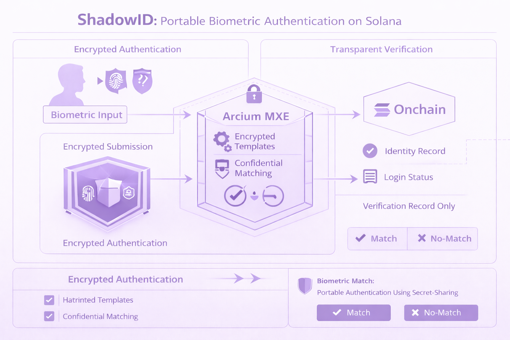
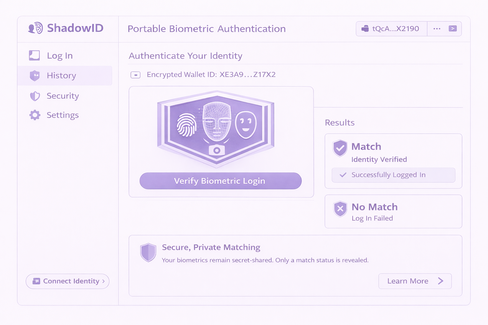

# ShadowID (Solana + Arcium)

> ShadowID explores how encrypted execution can enable portable biometric authentication.

Today biometric login is tightly bound to devices and vendors.

FaceID, fingerprint sensors, and other biometric systems store templates inside hardware enclaves controlled by specific platforms.

This creates a problem:

biometric identity is not portable.

ShadowID proposes a different model.

Biometric templates are secret-shared and processed inside Arcium MXE.

Applications only receive a simple result:

match or no-match.

---

## Problem

Biometric authentication today is:

- device siloed
- vendor controlled
- non-portable

Users cannot reuse biometric identity across platforms without exposing sensitive templates.

---

## Solution

ShadowID separates biometric storage from verification.

Encrypted:

- biometric templates
- matching computation

Revealed:

- match / no-match result

---

## Arcium Integration

Arcium MXE performs:

- encrypted template comparison
- confidential biometric matching

Solana handles:

- identity registry
- login verification records

Arcium becomes the confidential execution layer for authentication.

---

## Architecture

---

## Execution Flow

User biometric input  
↓  
Encrypted template submission  
↓  
Arcium MXE performs private matching  
↓  
Match / no-match returned  
↓  
Login authorized

---

## UI Mock

---

## Disclaimer

ShadowID is a structural prototype exploring confidential biometric authentication using Arcium.
